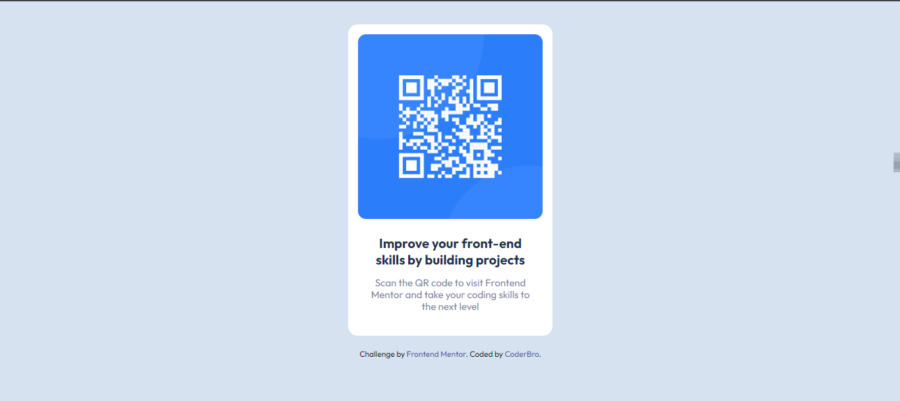
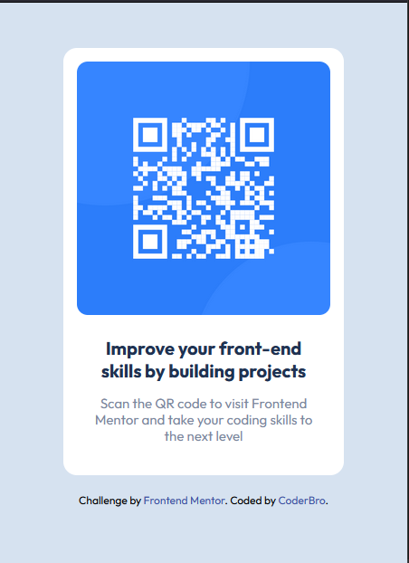

# Frontend Mentor - QR code component solution

This is a solution to the [QR code component challenge on Frontend Mentor](https://www.frontendmentor.io/challenges/qr-code-component-iux_sIO_H).

## Table of contents

- [Overview](#overview)
  - [Screenshot](#screenshot)
  - [Links](#links)
- [My process](#my-process)
  - [Built with](#HTML5-CSS3)
  - [What I learned](#what-i-learned)
  - [Continued development](#continued-development)
  - [Useful resources](#useful-resources)
- [Author](#CoderBro)
- [Acknowledgments](#acknowledgments)

**Note: Delete this note and update the table of contents based on what sections you keep.**

## Overview

### Screenshot




### Links

- Solution URL: [Add solution URL here][https://your-solution-url.com](https://github.com/CoderrBro/qr-code-component))
- Live Site URL: [Add live site URL here](https://your-live-site-url.com)

## My process

### Built with

- Semantic HTML5 markup
- CSS custom properties
- Flexbox

### What I learned
I Know Flex box nut Now I'ment about it.

For me it was very dificult to Modify The README-template.md file for upload properly.

To see how you can add code snippets, see below:

At the end, i believe i did a good job and boost my motivation with the things that i used.
I Always open to any comments.

```css
```css
body {
 background-color: var(--LightGray);
 font-family: "Outfit", sans-serif;
 display: flex;
 flex-direction: column;
 align-items: center;
 justify-content: center;
}

### Continued development

I would like to make my own QR Generator so this could be used as a default template.

The qr code could be links to a document or something along those ways. Going to think about something useful that could come in handy.

###Useful resources

- [FLEXBOX FROGGY](https://flexboxfroggy.com/#es) - This helped me to understand better how to use flexbox.
- [FLEXBOX FROGGY](https://youtu.be/fHLzngC0Bzo?si=WKVgj217d7W-mGim) - This Video helped me to understand better how to use flexbox.Mirpu-11, Block-B, Street-12, Dhaka-1216, Bangladesh

## Author

- Frontend Mentor - [@CoderBroo](https://www.frontendmentor.io/profile/CoderBroo)

## Acknowledgments

At some point i was a little stuck with setting the and upload Project.

This Video Helped me a lot.
(https://www.youtube.com/watch?v=JFyMWwOxHYM&t=865s)
